# Predicting Breast Cancer as Malignant or Benign

by Elijah Wikenheiser

## Context
Breast cancer accounts for over 12% of all new annual cancer cases worldwide.

An estimated 297,790 new cases of invasive breast cancer are expected in the U.S. alone, which equates to 1 in every 8 women.

While there is a lack of available data, medical diagnostic errors range from 5% to 28%.

## Data obtained from Diagnostic Wisconsin Breast Cancer Database

- [Wisconsin Breast Cancer Database](https://data.world/uci/breast-cancer-wisconsin-diagnostic)

Dataset is composed from cell nuclei present in images.

1378 training essays, of which only 3 are written by an AI. Each is labeled with a unique ID, their respective prompt ID, and a binary ‘generated’ label.

Includes the diagnosis of malignant or benign and characteristics such as radius, texture, perimeter, area, smoothness, etc.

## Diagnosis Counts - 357 Benign / 212 Malignant

  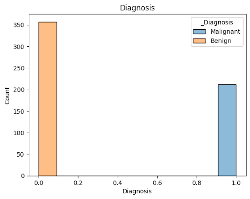

  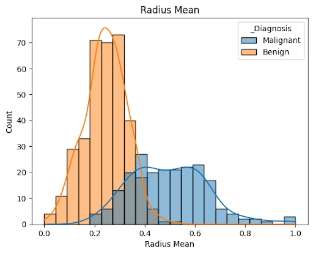
  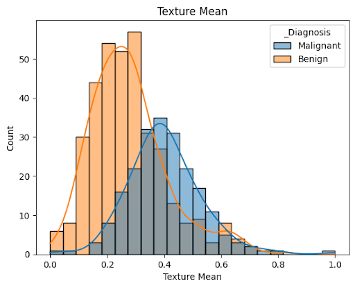

  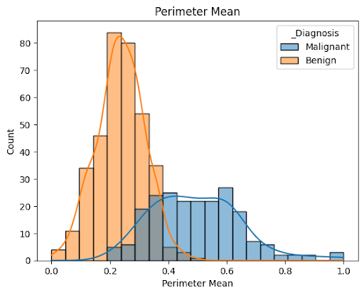
  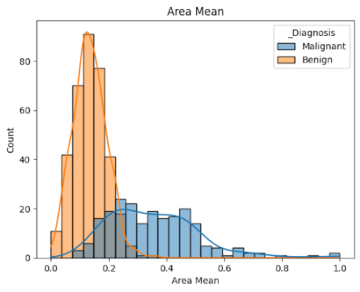

  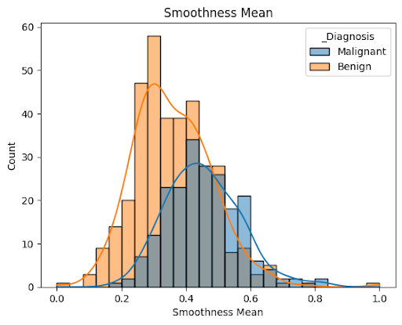
  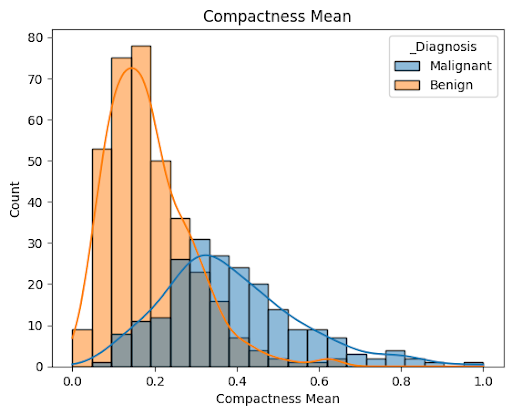

  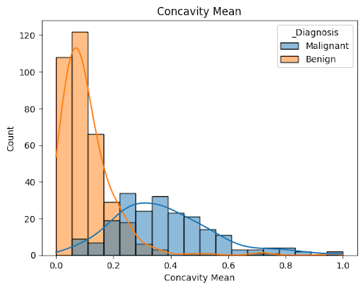
  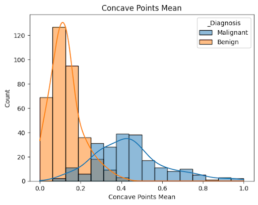

  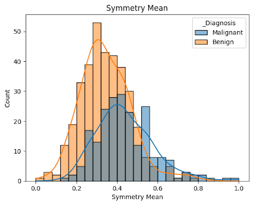
  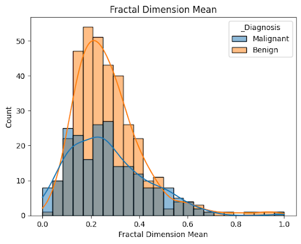

  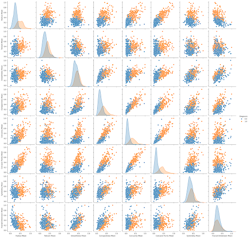

## Models to test:
- Decision Tree Classifier
- Decision Tree Regressor
- Gradient Boosting Regression
- K Nearest Neighbors
- K Nearest Neighbors Grid Search
- Logistic Regression
- Neat Neural Network
- Random Forest Classifier
- Random Forest Grid Search
- Random Forest Regressor

## Columns chosen:
- Radius Mean
- Texture Mean
- Smoothness Mean
- Compactness Mean
- Concavity Mean
- Concave Points Mean
- Symmetry Mean
- Fractal Dimension Mean

## Results

  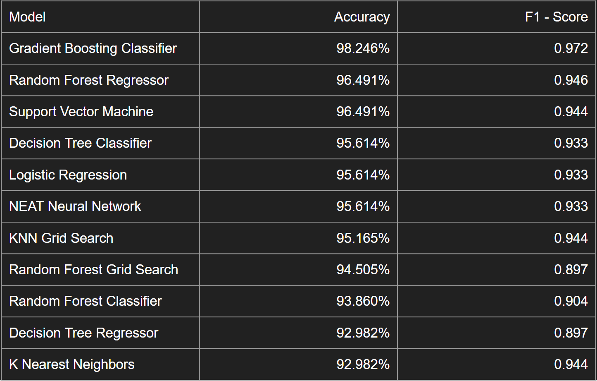

## Secondary Criteria:
‘Priyanki841’ SVM accuracy of 96.49%

## Columns chosen:
- Radius Mean
- Texture Mean
- Smoothness Mean
- Compactness Mean
- Symmetry Mean
- Fractal Dimension Mean
- Radius Standard Error
- Texture Standard Error
- Smoothness Standard Error
- Compactness Standard Error
- Symmetry Standard Error
- Fractal Dimension Standard Error

## Results - Priyanka841 Columns

  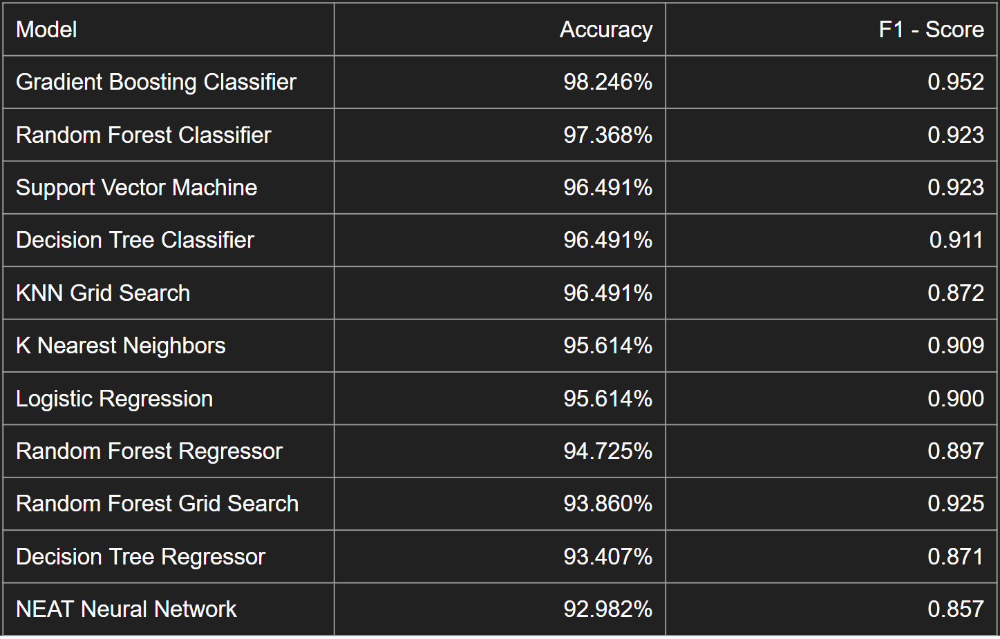

## Winning Model: Gradient Boosting Classifier

  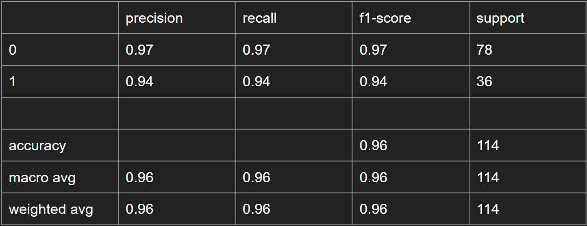

  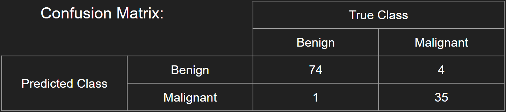

For a pathologist, high sensitivity is preferred over high specificity. Incorrectly diagnosed as positive is easier to catch and accommodate for during or after treatment.

## Conclusions
Out of 10 classification models, Gradient Boosting Classifier provided the best results at 98.246%.

With further data, model could be further trained with a preference to specificity.

In conjunction with other cytogenetic tests, classification models could provide another tool for catching breast cancer earlier and with higher accuracy.
